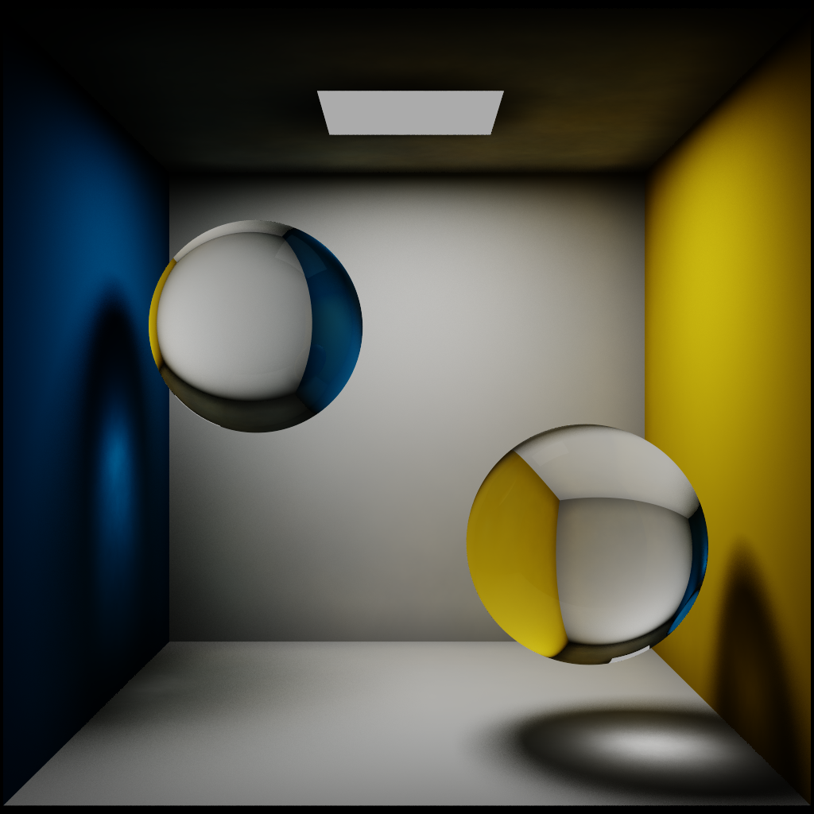
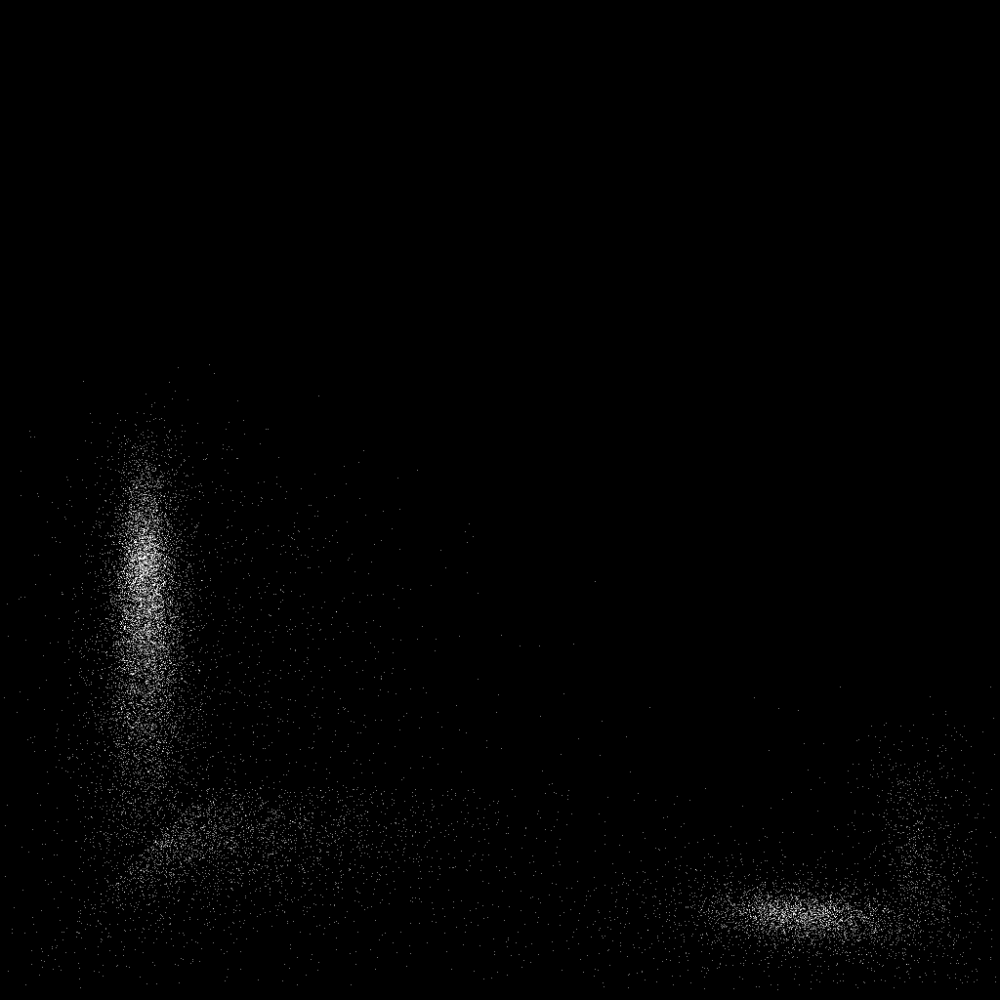
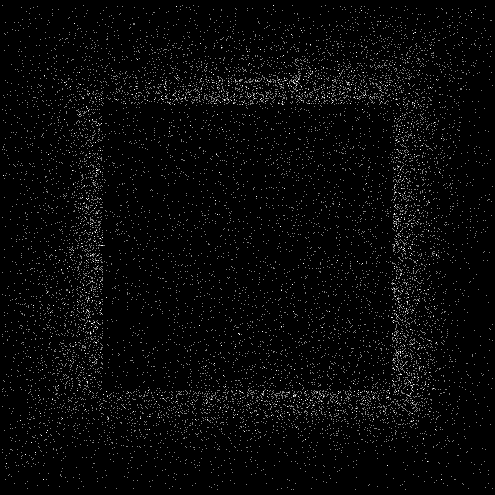

# Photon Mapping Rendering Engine

A high-performance rendering engine that implements photon mapping in C++. Uses a KD-Tree data structure to efficiently perform physically-based rendering algorithms.

  
*Example: Cornell box with two glass spheres.*

## Features

- Photon mapping-based global illumination
- Parallelized rendering using OpenMP
- Configurable light source and material properties
- Visualizations for photon distribution

## Installation and Setup

### Requirements

- **C++ Compiler**: Compatible with OpenMP (e.g., GCC)
- **Header Dependency**: [`stb_image_write.h`](https://github.com/nothings/stb) for image output

### Building the Project

To compile the project, run:

```bash
g++ -fopenmp -O3 .\main.cpp -o photon_mapper
```

### Running the Program

After building, you can execute the program with:

```bash
./photon_mapper
```

This will generate output images, including the final render and photon distribution visualizations.

## Photon Breakdown

Here are some sample visualization images of the photons generated by the rendering engine:

### Photon Distribution (Caustic Refraction)


### Photon Distribution (Diffuse Surface Refraction)


## Acknowledgments

- **STB Image Library**: Thanks to Sean Barrett for [`stb_image_write.h`](https://github.com/nothings/stb).

## License

This project is open-source and distributed under the MIT License. See `LICENSE` for more information.
